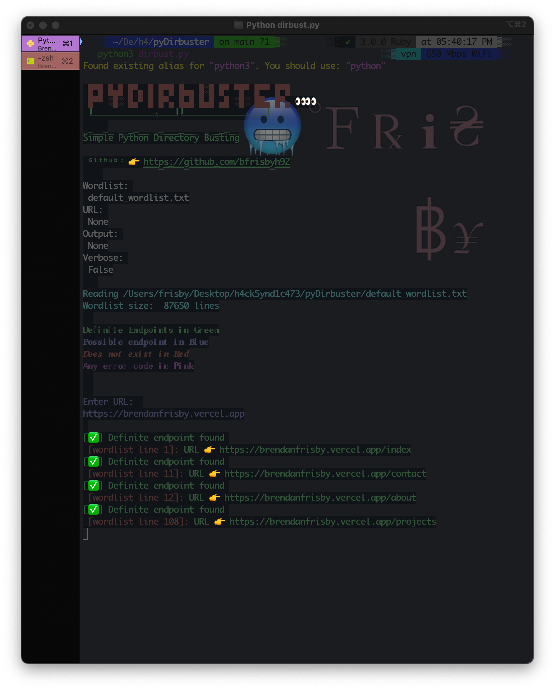

<h1 align='center'>Python Directory Brute Force</h1>

<h3 align='center'>A simple directory busting tool written in Python</h3>

<h3 align='center'>To-Do's</h3>
<ul align='center'>
<li align='center'>
Add a check if user adds '/' to end of URL or not.
</li>
<li align='center'>
Add feature for multiple appended wordlists
</li>
<li align='center'>
Change the display to more of a ticker style that updates display when new URL's are added to array
</li>
<li align='center'>
Fix the output when written to file
</li>
</ul>
