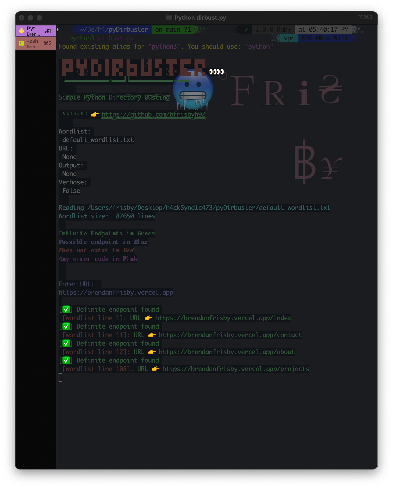

<h1 align='center'>PyDirbuster</h1>
<h3 align='center'>A simple directory busting tool written in Python</h3>

------------------------

<h2 align='center'>Install</h2>
<li>pip install -r requirements.txt</li>
<li>python3 dirbust.py -u {URL} -w {wordlist} -o {Output} -v[optional] -ua[optional] </li>

------------------------

<h4 align='center'>To-Do</h4>
- Threading
- Append Multiple Wordlists
